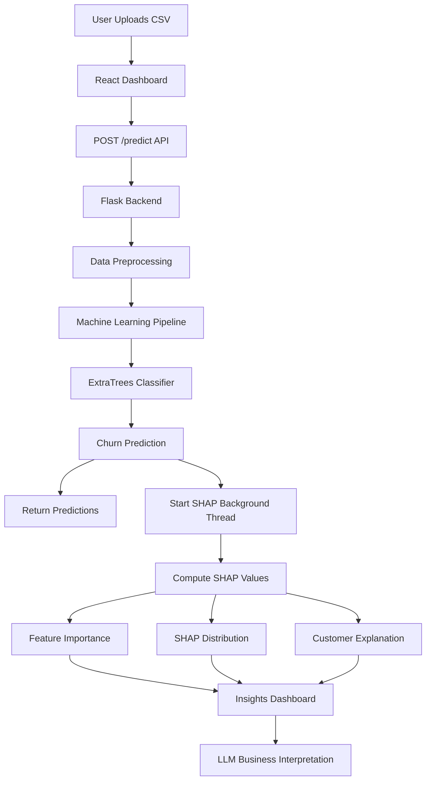
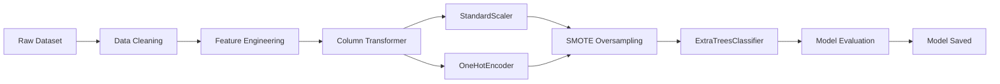

# 🧠 AI-Powered Bank Customer Churn Prediction

> Predict customer churn using **Machine Learning + Explainable AI + LLM Insights** with an **interactive full-stack analytics dashboard**.

An **end-to-end full stack Machine Learning system** that predicts whether a bank customer will **churn (leave the bank)** using behavioral, demographic, and transaction data.

The platform combines:

* 🌲 **ExtraTrees Machine Learning Model**
* 🔍 **SHAP Explainable AI**
* 🤖 **LLM-Generated Business Insights (Groq / Llama 3.3)**
* ⚡ **High-performance Flask API**
* 🎨 **Modern React Dashboard**

The system enables analysts and business teams to **predict churn risk, understand drivers of churn, and design retention strategies**.

---

# 🚀 Key Capabilities

✔ Upload customer datasets (CSV)
✔ Predict churn risk instantly
✔ Track prediction progress in real-time
✔ Download prediction results
✔ Explain predictions using **SHAP Explainable AI**
✔ Visualize feature importance
✔ Explore feature distributions
✔ Generate **AI business interpretations**
✔ Analyze individual customer churn drivers

---

# 🏗️ System Architecture



---


# 🧠 Machine Learning Pipeline



---

# 📊 Model Performance

| Metric       | Score                         |
| ------------ | ----------------------------- |
| **Accuracy** | **95.1%**                     |
| **AUC-ROC**  | **≈ 0.98 – 0.99**             |
| **F1 Score** | **≈ 0.97 – 0.98 (estimated)** |
| **Model**    | ExtraTreesClassifier          |
| **Trees**    | 305                           |

---

# 🔍 Explainable AI Dashboard

The **Model Insights Dashboard** provides full model transparency using **SHAP values**.

### Feature Importance

Identifies the most influential features affecting churn.

### SHAP Distribution

Visualizes how feature values impact churn probability.

### Individual Customer Analysis

Explains why a **specific customer is predicted to churn**.

### AI Interpretation

LLM generates **business-friendly explanations and retention strategies**.

---

# 🤖 AI-Generated Insights

The system integrates **Groq Llama-3.3-70B** to generate:

* Global model insights
* Customer churn explanations
* Retention recommendations
* Business-friendly summaries

If the LLM API is unavailable, the system **falls back to rule-based explanations**.

---

# ⚡ Performance Optimizations

### SHAP Background Processing

SHAP values are computed **asynchronously** after prediction.

### Dataset Hash Caching

Previously analyzed datasets reuse cached SHAP values.

### Batch Predictions

Large datasets are processed using **batch inference**.

### Session-Based Analytics

Each uploaded dataset is tracked using a **unique session ID**.

---

# 🎨 Frontend Dashboard

Built using **modern React architecture**.

Features:

* ⚡ Vite + React 18
* 🎨 TailwindCSS + Shadcn UI
* 📊 Recharts visualizations
* 🌙 Dark / Light theme toggle
* 📁 CSV upload interface
* 📈 Model insights dashboard
* 🔎 Customer risk explorer

---

# 📦 Tech Stack

| Layer          | Technology                 |
| -------------- | -------------------------- |
| Frontend       | React 18, TypeScript, Vite |
| UI             | TailwindCSS, Shadcn UI     |
| Charts         | Recharts                   |
| Backend        | Flask                      |
| ML             | scikit-learn               |
| Explainability | SHAP                       |
| Model          | ExtraTreesClassifier       |
| LLM            | Groq API (Llama-3.3-70B)   |

---

# 📂 Project Structure

```
bank-churn-prediction-ai

backend
│
├── app.py
├── preprocess.py
├── shap_utils.py
├── requirements.txt
├── model.pkl
├── model_metrics.json
├── feature_names.json
├── example_input.csv
└── example_output.csv

frontendd
│
├── src
│   ├── components
│   ├── hooks
│   ├── pages
│   └── lib
│
├── index.html
├── package.json
├── tailwind.config.ts
└── vite.config.ts

input
│
└── BankChurners.csv

save_model.py
README.md
```

---

# ⚙️ Installation

## 1️⃣ Clone Repository

```bash
git clone https://github.com/ShreyashS19/bank-churn-prediction-ai.git

cd bank-churn-prediction-ai
```

---

# Backend Setup

```bash
cd backend

python -m venv venv
```

**Activate virtual environment:**

```bash
# Windows CMD
venv\Scripts\activate

# Windows PowerShell
.\venv\Scripts\Activate.ps1
```

```bash
pip install -r requirements.txt

python app.py
```

Backend runs on:

```
http://localhost:5000
```

---

# Frontend Setup

```bash
cd frontendd

npm install

npm run dev
```

Frontend runs on:

```
http://localhost:8080
```

---

# 📥 Example Dataset

Example dataset included:

```
backend/example_input.csv
```

Example output:

```
backend/example_output.csv
```

---

# 🔌 API Endpoints

| Endpoint                 | Method | Description                         |
| ------------------------ | ------ | ----------------------------------- |
| `/predict`               | POST   | Upload dataset and start prediction |
| `/predict-progress`      | GET    | Check prediction progress           |
| `/download`              | GET    | Download predictions                |
| `/metrics`               | GET    | Model performance metrics           |
| `/feature-importance`    | GET    | Global SHAP feature importance      |
| `/shap-distribution`     | GET    | SHAP distribution data              |
| `/customer-explanation`  | POST   | Explain individual customer         |
| `/global-interpretation` | GET    | AI-generated global insights        |
| `/sample-customers`      | GET    | Get ranked customers by churn risk  |
| `/shap-status`           | GET    | Check SHAP computation status       |
| `/health`                | GET    | Backend health check                |

---


# 🧪 Model Training

To retrain the model:

```bash
python save_model.py
```

This generates:

```
model.pkl
model_metrics.json
feature_names.json
shap_values.pkl
```

---


# 💡 Why This Project Matters

Customer churn prediction enables banks to:

* Reduce customer attrition
* Identify high-risk customers
* Improve retention strategies
* Understand behavioral drivers of churn

Explainable AI ensures predictions are **transparent, trustworthy, and actionable**.

---

# ⭐ Support

If you found this project helpful:

⭐ Star the repository
🔗 Share it with others
💬 Provide feedback

---

