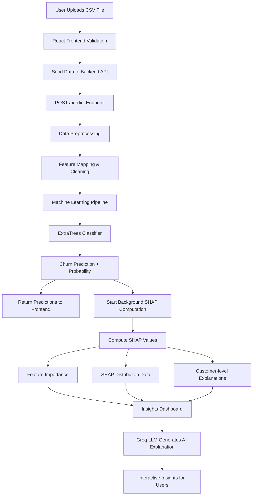
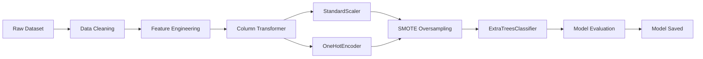

# 🧠 AI-Powered Bank Customer Churn Prediction

> Predict customer churn with **Explainable AI**, visualize insights with **interactive dashboards**, and generate **AI-driven interpretations**.

An **end-to-end full stack Machine Learning application** that predicts whether a bank customer will **churn (leave the bank)** using customer behavior and transaction data.

The system combines:

- **Machine Learning (ExtraTreesClassifier)**
- **Explainable AI (SHAP)**
- **LLM-powered explanations (Groq / Llama 3.3)**
- **Modern React dashboard**
- **Flask ML API**

---

# 🚀 Live Capabilities

✔ Upload customer datasets  
✔ Predict churn risk instantly  
✔ Explain predictions with **SHAP Explainable AI**  
✔ Visualize feature importance and distributions  
✔ Generate **AI-driven business explanations**  
✔ Explore individual customer churn drivers  

---

# 🏗️ System Architecture



---

# 🔄 Data Processing Flow

```mermaid
flowchart TD

A[Upload CSV] --> B[Frontend Validation]

B --> C[POST /predict]

C --> D[Backend Preprocessing]

D --> E[ML Pipeline]

E --> F[Model Prediction]

F --> G[Return Predictions]

F --> H[Background SHAP Calculation]

H --> I[/shap-status Polling]

I --> J[Feature Importance]

I --> K[SHAP Distribution]

I --> L[Customer Explanation]

J --> M[Insights Dashboard]
K --> M
L --> M
```

---

# 🧠 Machine Learning Pipeline



---

# 📊 Model Performance

| Metric | Score |
|------|------|
| Accuracy | **93.39%** |
| ROC-AUC | **0.9679** |
| F1 Score | **0.7721** |
| Model | ExtraTreesClassifier |
| Trees | 305 |

---

# 📊 Explainable AI Dashboard

The **Model Insights dashboard** explains predictions using **SHAP values**.

### Feature Importance
Shows which features contribute most to churn prediction.

### SHAP Distribution
Displays how feature values affect churn probability.

### Individual Customer Analysis
Shows **top risk drivers for a specific customer**.

### AI Interpretation
LLM explains the model behavior in **human language**.

---

# ✨ Key Features

### 🔮 Smart Churn Prediction

- Upload CSV dataset
- Predict churn risk
- Download predictions

---

### 🧠 Explainable AI

- SHAP feature importance
- SHAP scatter plots
- Customer-level explanations
- Feature impact visualization

---

### 🤖 AI Insights

Powered by **Groq Llama 3.3 70B**

Generates:

- Global model insights
- Customer churn explanations
- Retention recommendations

---

### 🎨 Modern Dashboard

- React + TypeScript
- TailwindCSS UI
- Recharts data visualizations
- Dark / Light theme

---

# 📦 Tech Stack

| Layer | Technology |
|------|-------------|
| Frontend | React 18, TypeScript, Vite |
| UI | TailwindCSS, Shadcn UI |
| Backend | Flask |
| ML | scikit-learn |
| Explainability | SHAP |
| Model | ExtraTreesClassifier |
| LLM | Groq API (Llama 3.3 70B) |

---

# 📂 Project Structure

```
BANK-CHURN-PREDICTION
│
├── backend
│   ├── app.py
│   ├── preprocess.py
│   ├── shap_utils.py
│   ├── model.pkl
│   ├── model_metrics.json
│   ├── example_input.csv
│   └── example_output.csv
│
├── frontend
│   ├── src
│   │   ├── pages
│   │   ├── components
│   │   ├── hooks
│   │   └── lib
│   │
│   └── vite.config.ts
│
├── input
│   └── BankChurners.csv
│
├── save_model.py
└── README.md
```

---

# ⚙️ Installation

## 1️⃣ Clone Repository

```bash
git clone https://github.com/ShreyashS19/bank-churn-prediction-ai.git

cd bank-churn-prediction-ai
```

---

# Backend Setup

```bash
cd backend

python -m venv venv

# Windows
venv\Scripts\activate

pip install -r requirements.txt

python app.py
```

Backend runs on:

```
http://localhost:5000
```

---

# Frontend Setup

```bash
cd frontend

npm install

npm run dev
```

Frontend runs on:

```
http://localhost:8080
```

---

# 📥 Example Dataset

Sample input is included.

```
backend/example_input.csv
```

Example output:

```
backend/example_output.csv
```

---

# 🔌 API Endpoints

| Endpoint | Method | Description |
|--------|--------|-------------|
| `/predict` | POST | Upload CSV and get predictions |
| `/download` | GET | Download prediction CSV |
| `/metrics` | GET | Model performance |
| `/feature-importance` | GET | SHAP feature importance |
| `/shap-distribution` | GET | SHAP scatter plot data |
| `/customer-explanation` | POST | Explain one customer |
| `/global-interpretation` | GET | AI-generated insights |

---

# 🔐 Environment Variables

Create `.env` inside backend:

```
GROQ_API_KEY=your_api_key_here
```

---

# 📸 Screenshots

*(Add screenshots after deployment)*

Dashboard  
Feature Importance  
Customer Explanation  
SHAP Distribution  

---

# 🧪 Model Training

Train the model using:

```bash
python save_model.py
```

This will generate:

- `model.pkl`
- `model_metrics.json`
- `shap_values.pkl`

---

# 💡 Why This Project Matters

Customer churn prediction helps banks:

- Reduce customer loss
- Improve retention strategies
- Identify at-risk customers
- Understand behavior patterns

Explainable AI ensures that predictions are **transparent and trustworthy**.

---

# ⭐ Support

If you like this project, consider **starring ⭐ the repository** to support the work!